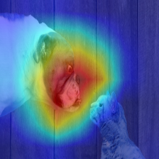

# Grad-CAM with PyTorch

PyTorch implementation of [Grad-CAM (Gradient-weighted Class Activation Mapping) [1]](##references). Grad-CAM localizes and highlights discriminative regions that convolutional neural networks-based models activate to predict visual concepts. This repository contains only implementation for image classification models.
*Please checkout ```pytorch_0.3.1``` branch for pytorch 0.3.1*.

## Dependencies
* Python 2.7
* pytorch 0.4.0
* torchvision 0.2.1
* click
* opencv

## Usage

```sh
python main.py --help
```

* ```-i```, ```--image-path```: a path to an image (required)
* ```-a```, ```--arch```: a model name from ```torchvision.models```, e.g., 'resnet152' (required)
* ```-k```, ```--topk```: the number of classes to generate (default: 3)
* ```--cuda/--no-cuda```: GPU or CPU

The command above generates, for top *k* classes:

* Gradients by vanilla backpropagation
* Gradients by guided backpropagation [[2](##references)]
* Gradients by deconvnet [[2](##references)]
* Grad-CAM [[1](##references)]
* Guided Grad-CAM [[1](##references)]

The guided-* do not support F.relu but only nn.ReLU in this codes.
For instance, off-the-shelf *inception_v3* cannot cut off negative gradients during backward operation (#2).

## Examples


```layer4.2``` of ```torchvision.models.resnet152```

||bull mastiff|tiger cat|boxer|
|:-:|:-:|:-:|:-:|
|Probability|0.54285|0.19302|0.10428|
|Grad-CAM [[1](##references)]||||
|Vanilla backpropagation||||
|"Deconvnet" [[2](##references)]||||
|Guided backpropagation [[2](##references)]||||
|Guided Grad-CAM [[1](##references)]||||

Grad-CAM visualization of *bull mastiff*

|Model|resnet152|vgg19|vgg19_bn|inception_v3|densenet201|
|:-:|:-:|:-:|:-:|:-:|:-:|
|Input|224x224|224x224|224x224|299x299|224x224|
|Grad-CAM [[1](##references)]||||||

## References

\[1\] R. R. Selvaraju, A. Das, R. Vedantam, M. Cogswell, D. Parikh, and D. Batra. "Grad-CAM: Visual Explanations from Deep Networks via Gradient-based Localization". arXiv, 2016<br>
\[2\] J. T. Springenberg, A. Dosovitskiy, T. Brox, and M. Riedmiller. "Striving for Simplicity: The All Convolutional Net". arXiv, 2014